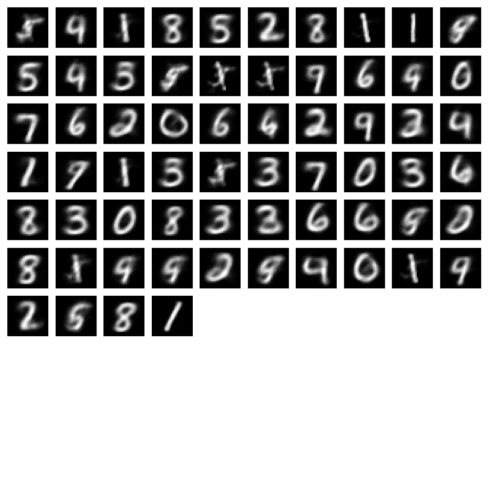
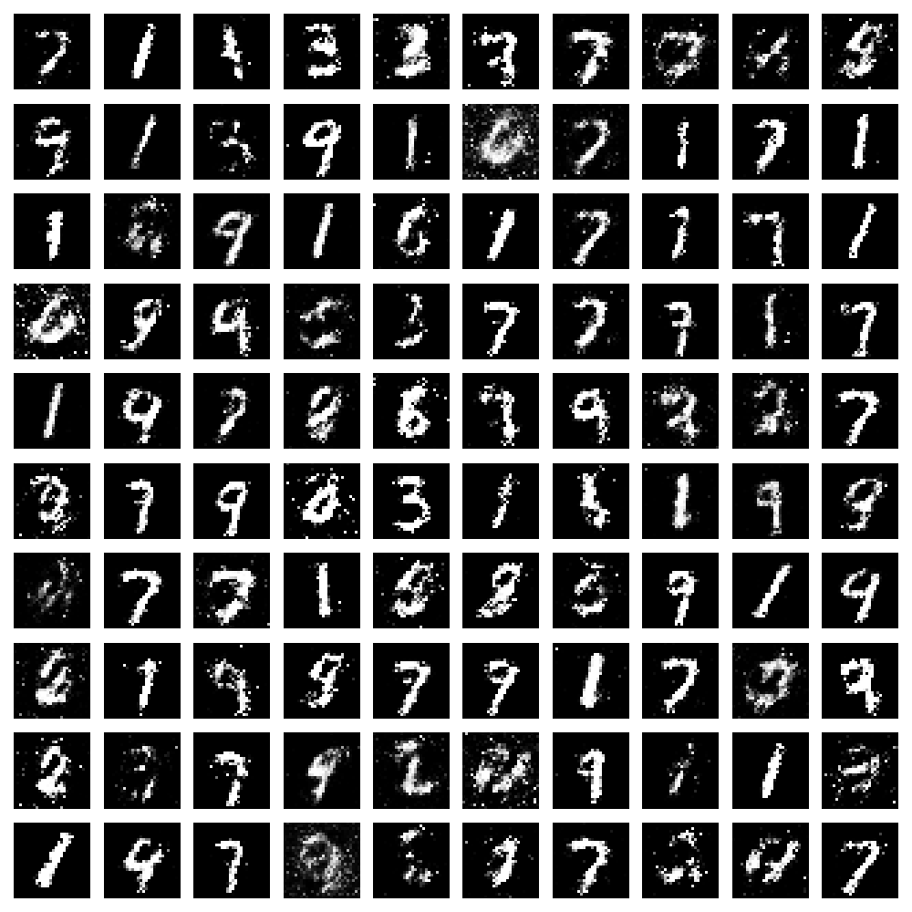
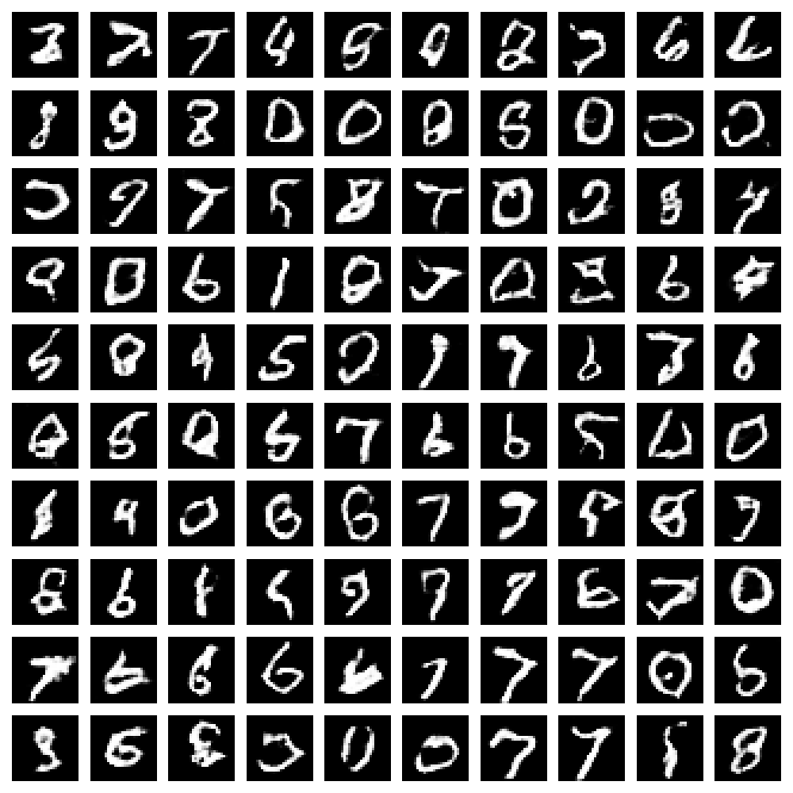

# VAE-Digit-Generator
Use Variational AutoEncoders to generate digit from MNIST dataset

# (DC)GAN-Digit-Generator
Use a Generator and a Discriminator to generate digit.
In the first part, we used a simple GAN

And in the second part, we used a DCGAN, it's the same as GAN but we use convolutional layer

